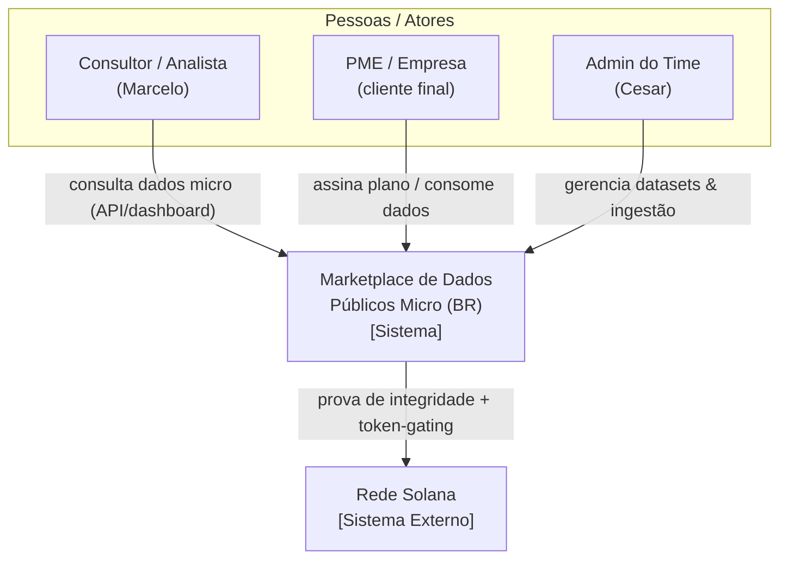
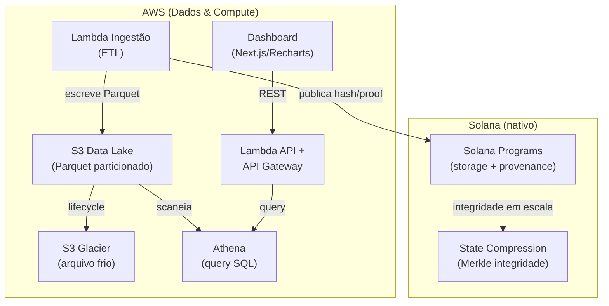
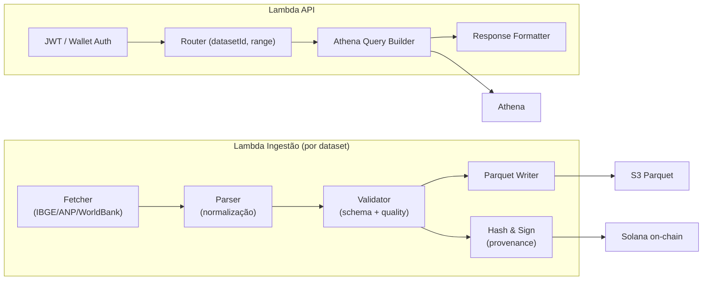
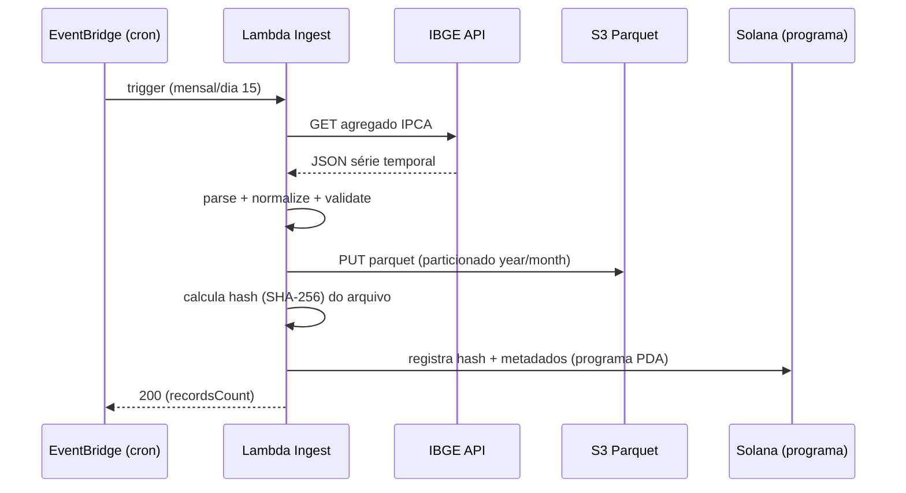

# Diagrama de Arquitetura C4 — Marketplace de Dados Públicos Micro (BR)

**Projeto:** Hackathon Colosseum 2026
**Data:** 22 Set 2026
**Modelo:** C4 (Context → Container → Component → Code)
**Base:** Solução inicialmente proposta pelo Marcelo + decisão de placement (AWS + Solana)

---

## C4 — Nível 1: Contexto (System Context)

Quem são os usuários e como interagem com o sistema.

---

## C4 — Nível 2: Contêineres (Containers)

---

## C4 — Nível 3: Componentes (dentro da Lambda de Ingestão + API)

---

## C4 — Nível 4: Código (exemplo — fluxo de ingestão IPCA)

---

## Notas de Decisão (ligadas ao placement)

- **Dados brutos & query** ficam na AWS (S3 + Athena) — ver `DECISAO-PLACEMENT-SOLANA-VS-AWS.md`.
- **Solana nativo** entra como camada de *provenance* (hash on-chain via programa próprio) e *monetização* (token-gating), não como storage de big data.
- **Sem storage cross-chain** (Irys/Walrus/Arweave) — fora de escopo por CON-000.
- **State compression** (Merkle) para integridade em escala, quando o nº de assets é grande.

---

**Última atualização:** 22 set 2026
